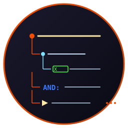
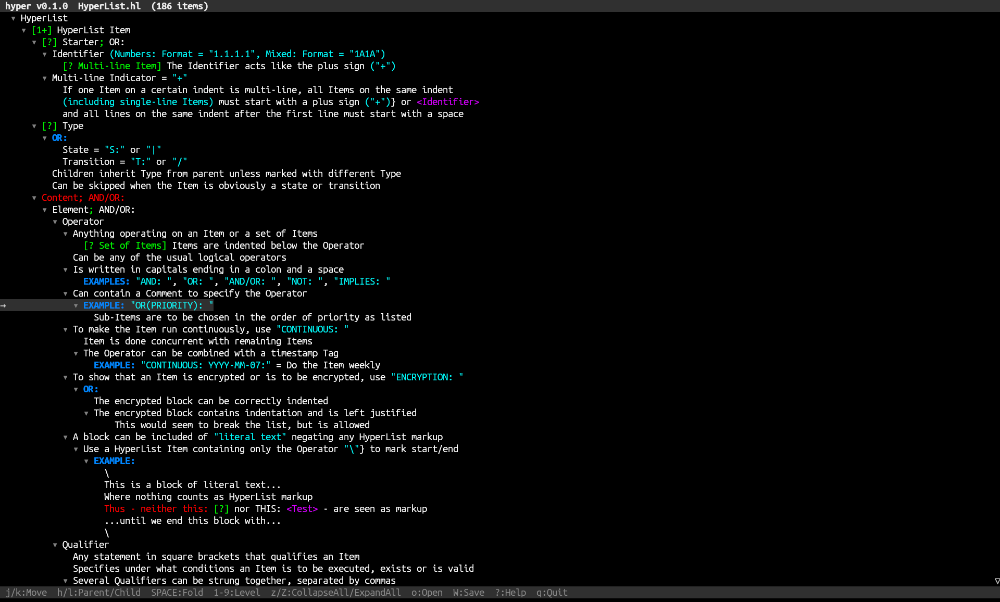

# Hyper - Terminal HyperList Viewer & Editor



   

Fast terminal viewer **and editor** for the [HyperList](https://isene.org/hyperlist/) outline format. Opens `.hl` files, renders them with full HyperList 2.6 syntax coloring, and brings the entire [hyperlist.vim](https://github.com/isene/hyperlist.vim) feature set to a standalone TUI: fold control, item editing, checkboxes, autonumbering, references, breadcrumbs, show/hide filters, presentation mode, complexity scoring, HTML / LaTeX / Markdown export, calendar export to [Tock](https://github.com/isene/tock), and gpg-symmetric encryption.

Rust feature port of the Ruby [HyperList TUI](https://github.com/isene/HyperList), built on [crust](https://github.com/isene/crust).

<br clear="left"/>

## Screenshot



*HyperList viewer with syntax coloring, folding, and indentation-driven structure.*

## Install

```bash
git clone https://github.com/isene/hyper
cd hyper
cargo build --release

# Open a HyperList file:
./target/release/hyper path/to/file.hl
```

## What is HyperList?

HyperList is a universal methodology for describing anything: any state, item, pattern, action, process, transition, program, or instruction set. It can be used as an outliner, a todo list, a process design tool, a data modeler, or any other way you want to describe something hierarchical.

Learn more: <https://isene.org/hyperlist/>

## Syntax coloring

Hyper colors HyperList source the same way the Ruby TUI and the Vim plugin do:

| Color | Role |
|---|---|
| Red | Properties (`Name: value`), dates, multi-line `+`, change markup |
| Green | Qualifiers `[...]`, checkboxes, state / transition markers, semicolons |
| Blue | Operators (ALL-CAPS ending in `:`, e.g. `AND:`, `OR:`) |
| Magenta | References `<...>`, `<<...>>`, `SKIP`, `END` |
| Cyan | Parentheses `(...)`, quoted strings |
| Yellow | Substitutions `{...}` |
| Orange | Hash tags `#tag` |

Inline `*bold*`, `/italic/`, `_underline_` formatting is rendered.

## Keys

### Navigation

| Key | Action |
|---|---|
| `j` / `DOWN` | Move down (visible items) |
| `k` / `UP` | Move up |
| `h` / `LEFT` | Jump to parent |
| `l` / `RIGHT` | Jump to first child (unfolds if needed) |
| `PgUP` / `PgDOWN` | Page |
| `g` / `HOME` | First item |
| `G` / `END` | Last item |
| `ENTER` / `r` | Goto reference (`<ref>`, `<<ref>>`, or `<file:…>` opens via xdg-open) |
| `t` | Goto next template element (item ending in `=`) |

### Folding & Views

| Key | Action |
|---|---|
| `SPACE` | Toggle fold on current item |
| `1` .. `9`, `a` .. `f` | Fold all to level 1–15 |
| `z` / `Z` | Collapse / expand all |
| `S` / `H` | Show / Hide items containing keyword |
| `F` | Clear show/hide filter |
| `*` | Toggle highlight current branch (dim outside subtree) |
| `p` | Toggle presentation mode (ancestors only) |

### Edit

| Key | Action |
|---|---|
| `i` | Edit current item |
| `O` / `+` | New item above / below at same depth |
| `D` | Delete current item and its subtree |
| `Tab` / `Shift-Tab` | Indent / outdent current subtree |
| `v` / `V` | Toggle checkbox / toggle with date stamp |
| `R` | Renumber whole document |
| `M-c` | Operator / property completion popup |

### Info

| Key | Action |
|---|---|
| `C` | Complexity score: items × (1 + max_depth/10) |

### Export

| Key | Action |
|---|---|
| `M-h` / `M-l` / `M-m` | Export to HTML / LaTeX / Markdown (writes alongside the source) |
| `M-g` | Calendar — write `.ics` per future-dated item to `~/.tock/incoming/` |

### Encryption (`gpg --symmetric`)

| Key | Action |
|---|---|
| `e` / `E` | Encrypt current subtree / whole file |
| `x` / `X` | Decrypt current subtree / whole file |

### Files

| Key | Action |
|---|---|
| `o` | Open a `.hl` file |
| `W` | Save current file |
| `?` / `q` / `Q` | Help / Quit (save) / Quit (no save) |

## Config line

A `.hl` file's first line may be a config block in double parens. Hyper honors `fold_level=N` at load time:

```
((fold_level=2, theme=normal))
	Parent
		Child (will be folded on load)
			Grandchild
```

## Part of the Rust Terminal Suite (Fe2O3)

See the [Fe₂O₃ suite overview](https://github.com/isene/fe2o3) and the [landing page](https://isene.org/fe2o3/) for the full list of projects.


## License

Unlicense (public domain).
